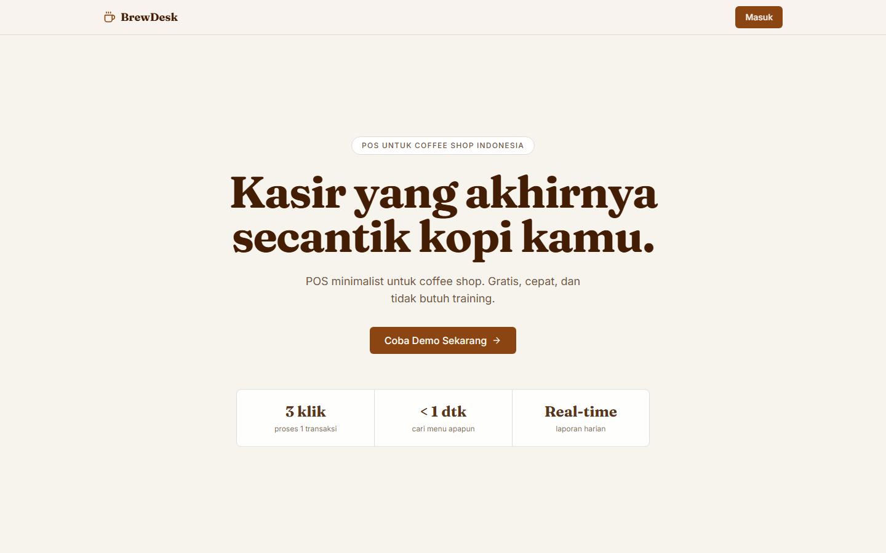
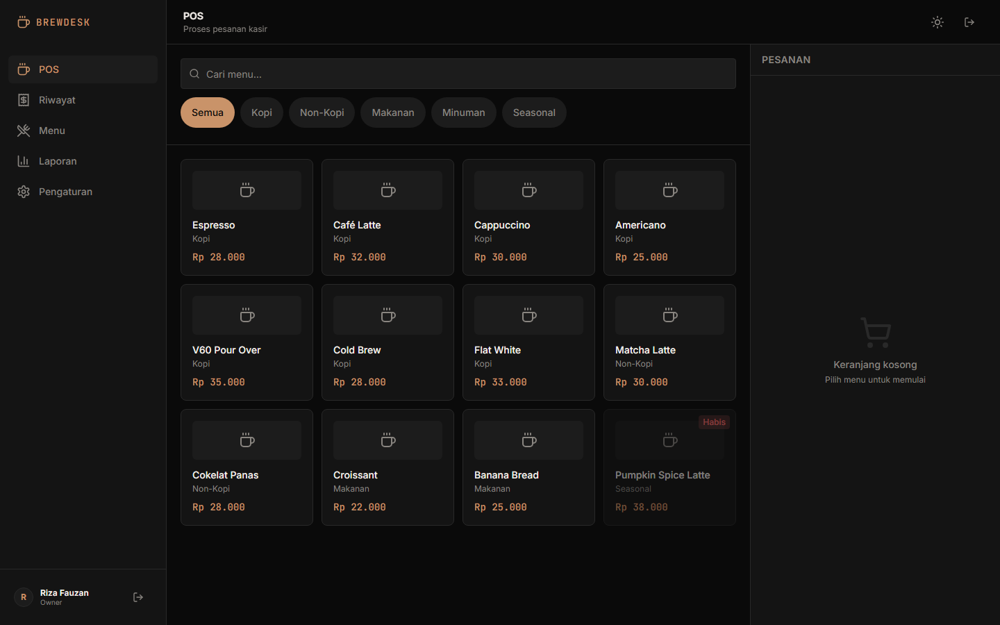
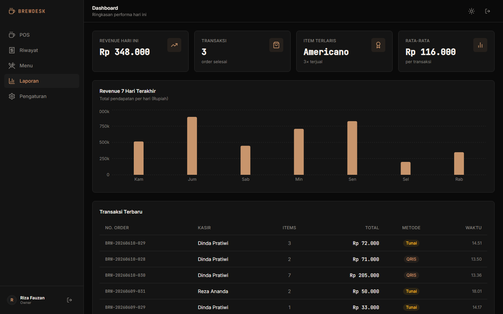
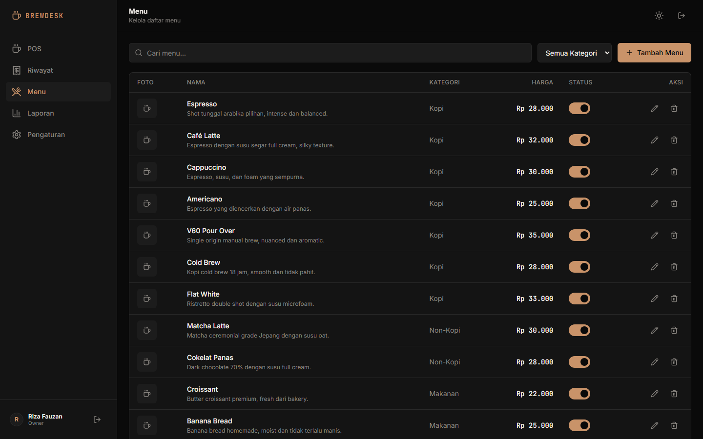
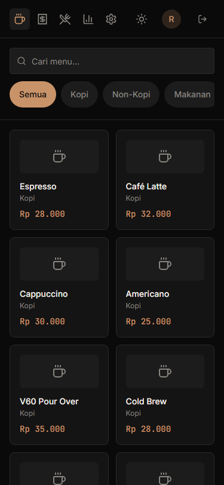
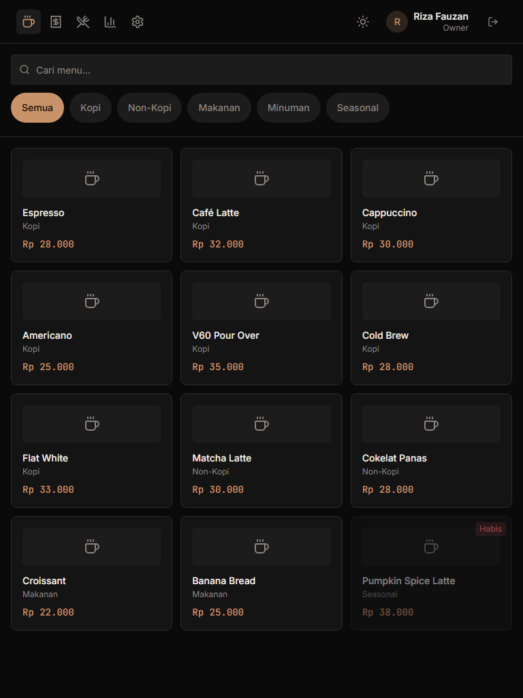
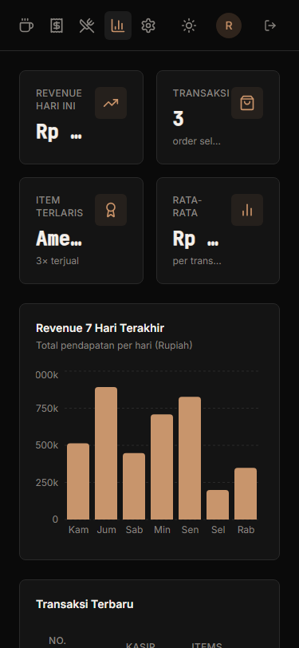
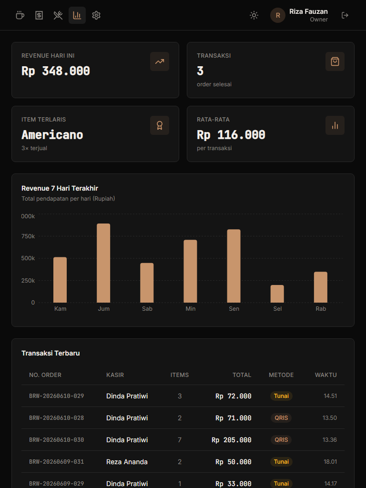
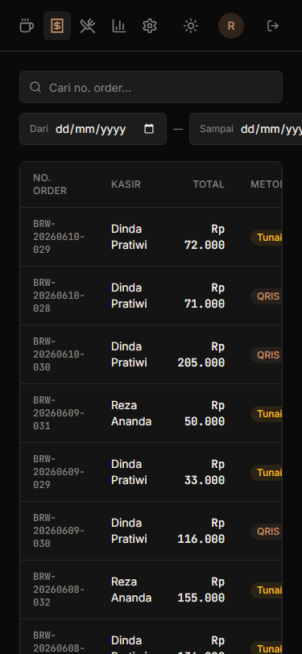
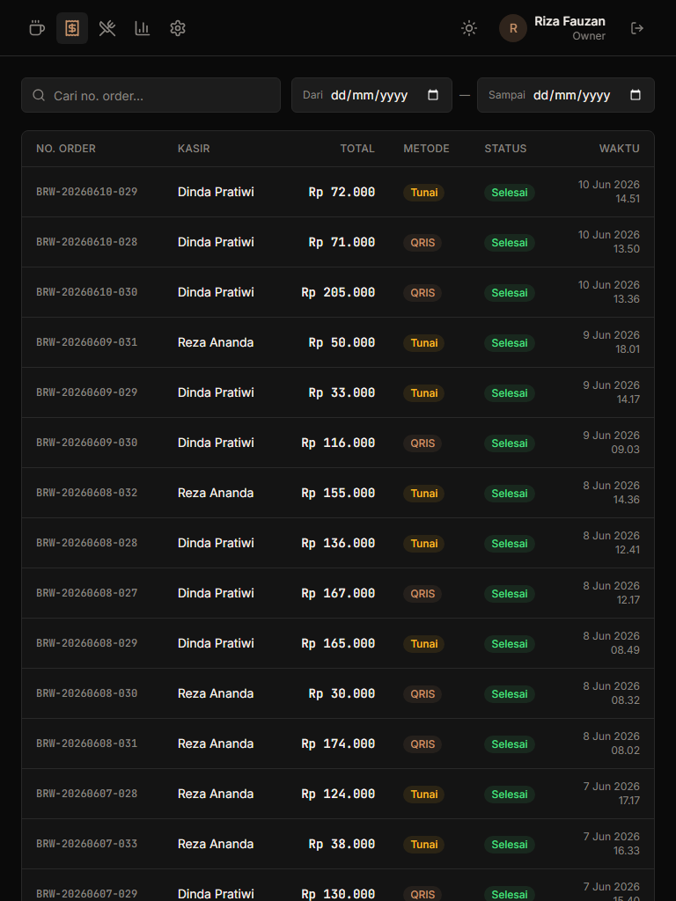

# BrewDesk

A minimalist Point-of-Sale application for coffee shops and small cafés. Built as a full-stack portfolio project.

---

## Features

**POS Interface**
- 2-panel split layout: menu grid (65%) + live cart (35%)
- Category filter, real-time cart with quantity badges
- Payment modal supporting Cash and QRIS methods
- Change calculator for cash payments

**Dashboard** *(owner only)*
- Today's revenue, total orders, and average order value
- 7-day revenue trend chart
- Recent orders table

**Menu Management** *(owner only)*
- Add, edit, and soft-delete menu items
- Availability toggle (shows/hides item on POS instantly)
- Category filter and search

**Order History**
- Filter by date range and order number search
- Order detail modal with itemized breakdown
- Kasir role sees only their own orders (enforced by RLS)

**Settings** *(owner only)*
- Update profile name
- Edit café info (name, address, phone, receipt footer note)
- Manage cashier accounts with active/inactive toggle

**Auth & Access Control**
- Role-based redirect: owner → Dashboard, kasir → POS
- Route protection middleware
- Row-Level Security on all Supabase tables

**Landing Page**
- Warm artisanal theme (cream + coffee brown palette)
- GSAP ScrollTrigger scroll animations
- Dark/light mode toggle throughout the app

---

## Screenshots

| Landing Page | POS Interface |
|---|---|
|  |  |

| Dashboard | Menu Management |
|---|---|
|  |  |

<details>
<summary>Mobile & Tablet</summary>

| | Mobile (375px) | Tablet (768px) |
|---|---|---|
| POS |  |  |
| Dashboard |  |  |
| Orders |  |  |

</details>

---

## Tech Stack

| Layer | Technology |
|---|---|
| Framework | Next.js 14 (App Router) |
| Language | TypeScript |
| Styling | Tailwind CSS + CSS Variables |
| Components | shadcn/ui (customized dark theme) |
| Database | Supabase (PostgreSQL + RLS) |
| Auth | Supabase Auth |
| State | Zustand (cart) |
| Charts | Recharts |
| Animations | GSAP + ScrollTrigger, Anime.js |
| Theme | next-themes |
| Toasts | Sonner |
| Deploy | Vercel + Supabase Cloud |

---

## Getting Started

### Prerequisites

- Node.js 18+
- A [Supabase](https://supabase.com) project

### Installation

```bash
git clone https://github.com/your-username/brewdesk.git
cd brewdesk
npm install
```

### Environment Variables

Create a `.env.local` file in the project root:

```env
NEXT_PUBLIC_SUPABASE_URL=your_supabase_project_url
NEXT_PUBLIC_SUPABASE_ANON_KEY=your_supabase_anon_key
SUPABASE_SERVICE_ROLE_KEY=your_service_role_key
NEXT_PUBLIC_APP_URL=http://localhost:3000
NEXT_PUBLIC_APP_NAME=BrewDesk
NEXT_PUBLIC_DEMO_EMAIL=demo@brewdesk.app
NEXT_PUBLIC_DEMO_PASSWORD=demo123456
```

### Database Setup

Run the seed script in your Supabase SQL editor:

```bash
# The file is located at:
supabase/seed.sql
```

This creates:
- 5 menu categories
- 12 menu items
- 1 owner account + 2 cashier accounts
- 30 historical orders (last 7 days)

### Run Locally

```bash
npm run dev
```

Open [http://localhost:3000](http://localhost:3000).

---

## Demo Accounts

| Role | Email | Password |
|---|---|---|
| Owner | demo@brewdesk.app | demo123456 |
| Kasir | kasir1@brewdesk.app | demo123456 |
| Kasir | kasir2@brewdesk.app | demo123456 |

---

## Project Structure

```
/app
  /(auth)/login          # Login page
  /(dashboard)
    /pos                 # POS interface (default for kasir)
    /orders              # Order history
    /menu                # Menu management (owner)
    /reports             # Dashboard & charts (owner)
    /settings            # Settings (owner)
  /page.tsx              # Landing page
/components
  /pos                   # MenuGrid, CartPanel, PaymentModal, ReceiptModal
  /menu                  # MenuTable, MenuFormModal, CategorySection
  /dashboard             # StatCard, RevenueChart, RecentOrdersTable
  /orders                # OrdersInterface, OrderDetailModal
  /settings              # ProfileSettings, CashierManagement
  /landing               # Hero, Features, Footer, LandingAnimations
  /layout                # Sidebar, Navbar, ThemeToggle
/lib
  /supabase              # Browser + server clients
  /utils.ts              # formatRupiah, formatDate, generateOrderNumber
/stores
  /cartStore.ts          # Zustand cart store
/types
  /index.ts              # Shared TypeScript types
```

---

## Design System

- **App interior**: Dark mode default `#0A0A0A` with light mode toggle
- **Landing page**: Warm artisanal — cream `#F7F3EE` + coffee brown `#8B4513`
- **Accent**: Amber `#C8956C` (dark mode) / `#8B4513` (landing)
- **Typography**: Fraunces (landing hero) · Inter (app UI) · JetBrains Mono (prices)
- **POS layout**: 2-panel split — menu grid 65% + cart 35%

---

## License

MIT
